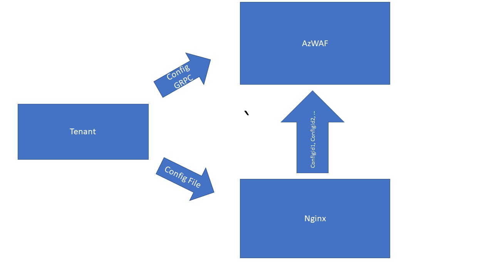

#WAF Configuration
This is the top level WAF configuration that defines WAF services at per-site or per-URI level.

# Terminology
These are the nouns that are used to define a WAF configuration.
## Service
An instance of an engine that provides a specific WAF service. Examples of engines are:
* SecRule Engine
* IP reputation engine.
* GeoDB engine.
* Bot detection engine.

## Site
A domain on which we can enable a set of WAF services.

## URI
A fully qualified URL on which we can enable a set of WAF services.

## Service Configuration
A YAML definition of a configuration that can be taken by a service.

# Architecture

Multiple Snap Shots Architecture

  
We will be introducing a GRPC API in Azwaf which will be used by the tenant to configure Azwaf. This API will allow the the tenant to trigger changes in Azwaf when it receives configuration updates from GWM.

The configuration API will be supported by a configuration manager module (CFGM) within Azwaf. This module will be responsible for keeping track of the current configuration, caching it on disk for restarts, and performing hitless reload on services whose configuration has changed.

Multiple Snap Shots Architecture:
Waf Next Gen always keeps multiple generations of configuration maps in memory, each configuration map is hash table structure with key as config id and value will be different type of config.
Nginx are using the config id in the GRPC call to differentiate the configs between the older worker and new worker.
Tenant should maintain the transaction of applying config on Azwaf and Nginx.
The process is as following:

1. Tenant send config GRPC call to Azwaf to update the config. Azwaf call config manager to generate new config in memory with new config id, and report success.
2. After Tenant receive success status of Azwaf, it start to apply the config to the Nginx. Nginx will apply the config, increase the generation id and report success.
3. Tenant report success for config update.
During this process, any steps could fail, here is the summary:
step 1 failed: Tenant will stop applying config and report failure
step 2 failed: Tenant will update Azwaf to Dispose all the newly created configs and services.
With this method, Azwaf will keep multiple version of configs in memory, also it needs to keep track of connection with Nginx workers. If the connection with old config id go away, it needs to call the service manager to release the memory of the old running services.

# Configuration Schema
The schema has beend defined as protobuf in `proto/config.proto` .

# Configuration Manager
The configuration manager will be responsible for responding to the config API to learn about any new WAF configuration. It will keep track of the current configuration at a per-service level and initiate a state change for a given service when the configuration provided changes.

Internal API in AzWAF():
Apply_Config:
Apply_Config will take config protobuf from Tenant and convert into hash table structure config map, they key will be service config id, and the value will be corresponding service config. Service will later take this hash table and create service for each config.  
Reload_Config:
Config Manager will persist config in the disk for failure recover. So once called, config manager will read the latest config file from disk and generate corresponding config data structure in memory.

# Service Manager
The Service Manager will use the config from config manager, and create all the service needed to run. It is also responsible for routing incoming request to the right chain of services. In that sense, it will generate the similar hash table structure service map as config manager, the key will be config id, and value will the service instance created by the config value in the config map. Last, it will garbage collect all the services not needed once the connection between Nginx old worker got cut off.

Internal API in AzWAF:
Create_Service:
Create_Service will create one to one mapping service from the config map. And this service will handle concurrency requests. So in service manager, we don't need to worry about handling the concurrency.
Dispose_Service:
Dispose_Service will free the service not needed and clean up the internal service map.
